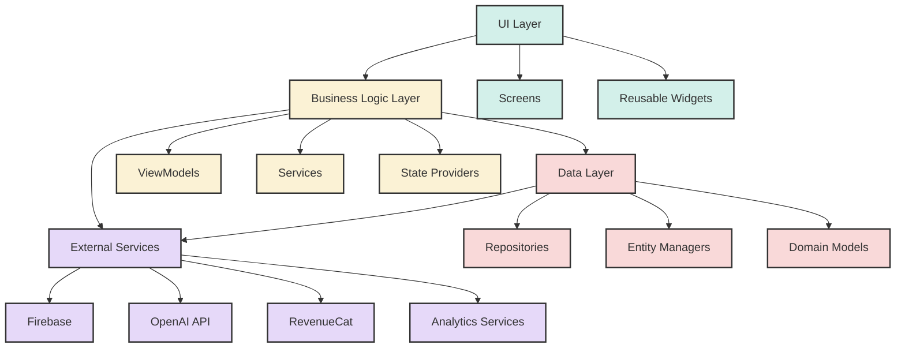
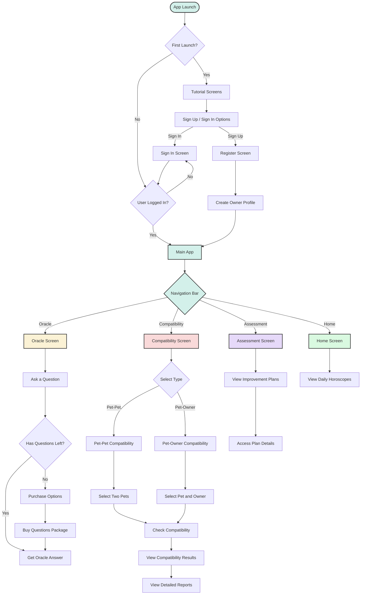
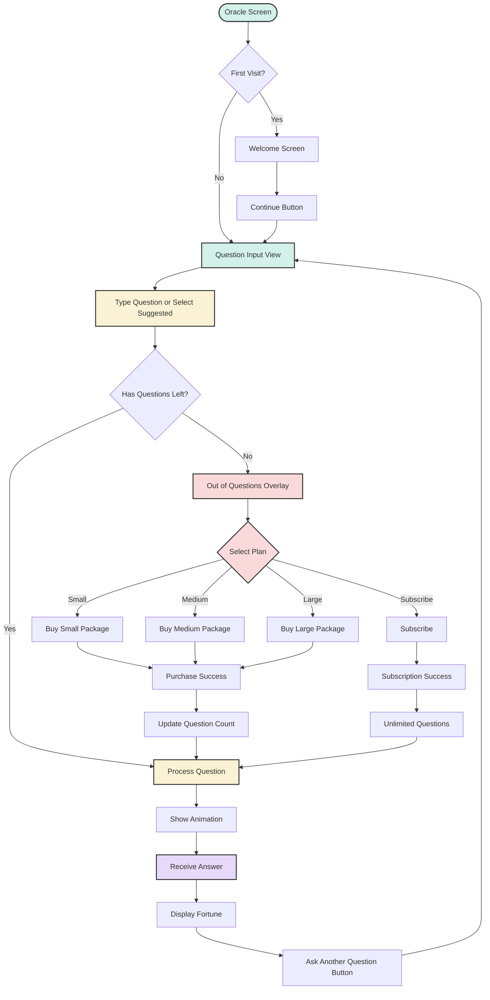
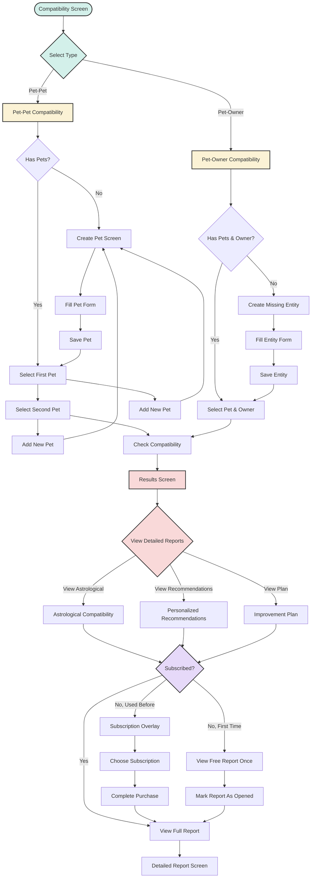
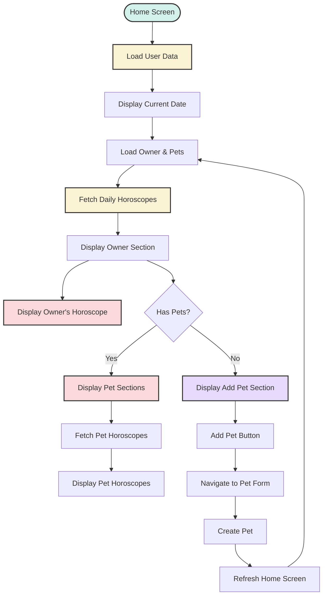
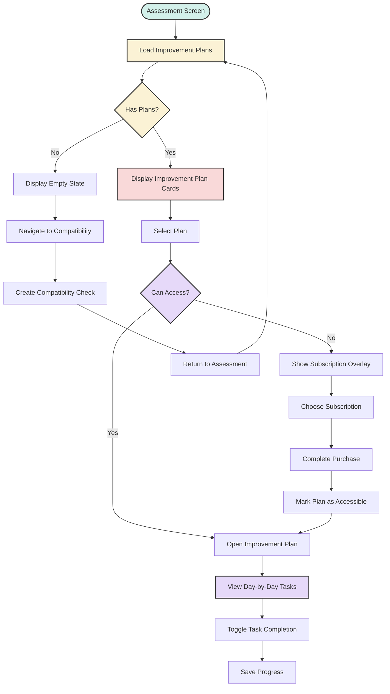

# Doracle Technical Documentation

## Table of Contents

1. [Introduction](#introduction)
2. [Architecture Overview](#architecture-overview)
   - [High-Level Architecture](#high-level-architecture)
   - [Detailed Architecture](#detailed-architecture)
3. [User Flows](#user-flows)
   - [Main User Flow](#main-user-flow)
   - [Oracle Feature Flow](#oracle-feature-flow)
   - [Compatibility Feature Flow](#compatibility-feature-flow)
   - [Home Screen Flow](#home-screen-flow)
   - [Assessment Feature Flow](#assessment-feature-flow)
4. [Implementation Guidelines](#implementation-guidelines)
   - [General Dart Guidelines](#general-dart-guidelines)
   - [Flutter Project Guidelines](#flutter-project-guidelines)
5. [Dependency Management](#dependency-management)
6. [External Services Integration](#external-services-integration)
   - [Firebase](#firebase)
   - [OpenAI](#openai)
   - [RevenueCat](#revenuecat)
   - [Analytics](#analytics)

## Introduction

Doracle is a sophisticated Flutter application that combines pet lifestyle management with AI-powered insights and compatibility analysis. This document provides a technical overview of the application's architecture, user flows, and implementation guidelines.

Key features of the application include:
- Pet and owner profile management
- AI-powered oracle for answering user questions
- Compatibility analysis between pets and owners
- Daily horoscopes for pets and owners
- Monetization through in-app purchases and subscriptions

## Architecture Overview

### High-Level Architecture

The Doracle app follows a layered architecture pattern with clear separation of concerns:

Each layer has specific responsibilities:

1. **UI Layer**: Contains all screens and reusable widgets
2. **Business Logic Layer**: Houses view models, services, and state providers
3. **Data Layer**: Manages repositories, entity managers, and domain models
4. **External Services**: Connects to Firebase, OpenAI, RevenueCat, and analytics platforms

This architecture provides the following benefits:
- Clear separation of concerns
- Improved testability
- Easier maintenance
- Better scalability

### Detailed Architecture

A more detailed view of the application's architecture reveals the specific components and their relationships:

```mermaid
graph TB
    %% Main Application Structure
    App[Main App] --> DI[Dependency Injection]
    App --> Theme[Theme Configuration]
    App --> AppManager[App Manager]
    
    %% Screens and UI Layer
    AppManager --> Screens[Screens]
    Screens --> HomeScreen[Home Screen]
    Screens --> UnifiedFortuneScreen[Oracle Screen]
    Screens --> CompatibilityScreens[Compatibility Screens]
    Screens --> AssessmentScreen[Assessment Screen]
    CompatibilityScreens --> PetCompat[Pet-Pet Compatibility]
    CompatibilityScreens --> OwnerCompat[Owner-Pet Compatibility]
    Screens --> ResultScreens[Result Screens]
    ResultScreens --> CompatResult[Compatibility Results]
    ResultScreens --> ImprovementPlan[Improvement Plans]
    
    %% Widgets Shared Components
    Screens --> Widgets[Widgets]
    Widgets --> NavBar[Navigation Bar]
    Widgets --> FortuneComponents[Fortune Components]
    Widgets --> EntityComponents[Entity Components]
    Widgets --> FormComponents[Form Components]
    Widgets --> PurchaseComponents[Purchase Components]

    %% Business Logic Layer
    AppManager --> ViewModel[ViewModels]
    ViewModel --> FortuneViewModel[Fortune ViewModel]
    AppManager --> Services[Services]
    
    %% Services
    Services --> AuthService[Auth Service]
    Services --> UserService[User Service]
    Services --> AnalyticsServices[Analytics Services]
    AnalyticsServices --> UnifiedAnalytics[Unified Analytics]
    AnalyticsServices --> FirebaseAnalytics[Firebase Analytics]
    AnalyticsServices --> FacebookEvents[Facebook Events]
    AnalyticsServices --> AdjustService[Adjust Service]
    Services --> FortuneTeller[Fortune Teller]
    Services --> OpenAIService[OpenAI Service]
    Services --> CompatibilityServices[Compatibility Services]
    CompatibilityServices --> CompatScoreService[Compatibility Score]
    CompatibilityServices --> CompatContentService[Compatibility Content]
    CompatibilityServices --> DailyHoroscopeService[Daily Horoscope]
    Services --> RevenueCatService[RevenueCat Service]
    Services --> HapticService[Haptic Service]
    Services --> AIPromptService[AI Prompt Generation]
    Services --> FirstLaunchService[First Launch Service]
    
    %% Providers for State Management
    DI --> Providers[Providers]
    Providers --> EntitlementProvider[Entitlement Provider]
    
    %% Data Layer - Repositories
    Services --> Repositories[Repositories]
    Repositories --> UserRepository[User Repository]
    Repositories --> FortuneContentRepo[Fortune Content]
    Repositories --> CompatibilityDataRepo[Compatibility Data]
    Repositories --> DailyHoroscopeRepo[Daily Horoscope]
    
    %% Entity Management
    Services --> EntityManagers[Entity Managers]
    EntityManagers --> PetManager[Pet Manager]
    EntityManagers --> OwnerManager[Owner Manager]
    
    %% Domain Models
    EntityManagers --> Models[Models]
    Models --> PetModel[Pet Model]
    Models --> OwnerModel[Owner Model]
    Models --> UserModel[User Model]
    
    %% External Services
    Services --> ExternalServices[External Services]
    ExternalServices --> Firebase[Firebase]
    Firebase --> FirebaseAuth[Firebase Auth]
    Firebase --> Firestore[Firestore]
    Firebase --> FirebaseCrashlytics[Crashlytics]
    ExternalServices --> OpenAI[OpenAI API]
    ExternalServices --> RevenueCat[RevenueCat]
    
    %% Helper/Utility Classes
    AppManager --> Helpers[Helpers]
    Helpers --> Constants[Constants]
    Helpers --> CompatibilityUtils[Compatibility Utils]
    Helpers --> PurchaseUtils[Purchase Utils]
    Helpers --> ShowSnackbar[UI Helpers]
    Helpers --> Mixins[Mixins]
    Mixins --> ShakeDetector[Shake Detector]
    Mixins --> FortuneAnimation[Fortune Animation]

    %% Configuration
    App --> Config[Configuration]
    Config --> FirebaseOptions[Firebase Options]
    Config --> Notifications[Notifications Config]
    Config --> AdjustConfig[Adjust Config]

    %% Color coding
    classDef uiLayer fill:#d3f0ea,stroke:#333,stroke-width:1px
    classDef businessLogic fill:#fbf2d5,stroke:#333,stroke-width:1px
    classDef dataLayer fill:#f9d9d9,stroke:#333,stroke-width:1px
    classDef domain fill:#d9e6f9,stroke:#333,stroke-width:1px
    classDef external fill:#e6d9f9,stroke:#333,stroke-width:1px
    classDef config fill:#f9f9d9,stroke:#333,stroke-width:1px
    classDef utility fill:#d9f9e0,stroke:#333,stroke-width:1px

    class Screens,Widgets,NavBar,FortuneComponents,EntityComponents,FormComponents,PurchaseComponents,HomeScreen,UnifiedFortuneScreen,CompatibilityScreens,AssessmentScreen,PetCompat,OwnerCompat,ResultScreens,CompatResult,ImprovementPlan uiLayer
    class ViewModel,Services,FortuneViewModel,AuthService,UserService,AnalyticsServices,FortuneTeller,OpenAIService,CompatibilityServices,RevenueCatService,HapticService,AIPromptService,FirstLaunchService,UnifiedAnalytics,FirebaseAnalytics,FacebookEvents,AdjustService,CompatScoreService,CompatContentService,DailyHoroscopeService,Providers,EntitlementProvider businessLogic
    class Repositories,UserRepository,FortuneContentRepo,CompatibilityDataRepo,DailyHoroscopeRepo,EntityManagers,PetManager,OwnerManager dataLayer
    class Models,PetModel,OwnerModel,UserModel domain
    class ExternalServices,Firebase,FirebaseAuth,Firestore,FirebaseCrashlytics,OpenAI,RevenueCat external
    class Config,FirebaseOptions,Notifications,AdjustConfig,Theme config
    class Helpers,Constants,CompatibilityUtils,PurchaseUtils,ShowSnackbar,Mixins,ShakeDetector,FortuneAnimation,DI utility
```

The detailed architecture shows all the major components of the application and their relationships, providing a comprehensive view of the codebase structure.

## User Flows

### Main User Flow

This flow diagram illustrates the overall user journey from app launch through to the main navigation options:

Key paths in this flow include:
- First-time user onboarding (tutorial and registration)
- Authentication flow
- Main navigation between the app's primary features
- High-level overview of each feature's core functionality

### Oracle Feature Flow

This flow diagram details the question-and-answer interaction in the Oracle feature:

Key aspects of this flow include:
- Welcome screen for first-time users
- Question input and suggestion options
- Question credits management and purchase flow
- Answer processing and display animations
- Option to ask another question

### Compatibility Feature Flow

This flow diagram illustrates the pet/owner compatibility assessment process:

Key aspects of this flow include:
- Choosing between pet-pet or pet-owner compatibility
- Creating new pets or owners if needed
- Selecting entities for compatibility assessment
- Viewing compatibility results
- Accessing detailed reports based on subscription status

### Home Screen Flow

This flow diagram outlines the daily horoscope feature:

Key aspects of this flow include:
- Loading user and pet data
- Fetching and displaying daily horoscopes for the owner and pets
- Adding new pets to receive pet-specific horoscopes
- Refreshing content when new pets are added

### Assessment Feature Flow

This flow diagram shows the improvement plan management flow:

Key aspects of this flow include:
- Loading and displaying existing improvement plans
- Access control based on subscription status
- Viewing plan details and tracking task completion
- Navigation to create new compatibility assessments when no plans exist

## Implementation Guidelines

### General Dart Guidelines

#### Basic Principles

- Use English for all code and documentation
- Always declare the type of each variable and function
- Don't leave blank lines within a function
- Keep file organization clean and consistent

#### Nomenclature

- Use PascalCase for classes
- Use camelCase for variables, functions, and methods
- Use snake_case for file and directory names
- Use UPPERCASE for constants
- Start each function with a verb
- Use verbs for boolean variables (isLoading, hasError, etc.)
- Use complete words instead of abbreviations

#### Functions

- Write short functions with a single purpose (< 20 instructions)
- Name functions with a verb and something else
- Avoid nesting blocks by using early returns and utility functions
- Use higher-order functions when appropriate
- Use default parameter values instead of null checks
- Use a single level of abstraction within a function

#### Data

- Encapsulate data in composite types
- Prefer immutability for data (use final and const)
- Use classes with internal validation

#### Classes

- Follow SOLID principles
- Prefer composition over inheritance
- Write small classes with a single purpose
- Declare abstract classes or interfaces when appropriate

### Flutter Project Guidelines

- Organize code using the layered architecture described above
- Use Provider package with ChangeNotifier for state management
- Use GetIt for dependency injection
- Follow the repository pattern for data persistence
- Use services to handle business logic and external integrations
- Break down large widgets into smaller, focused components
- Use const constructors wherever possible
- Optimize for performance and avoid unnecessary rebuilds

## Dependency Management

The Doracle application uses a variety of dependencies, managed through `pubspec.yaml`:

- **State Management**: Provider with ChangeNotifier
- **Dependency Injection**: GetIt
- **Firebase**: Firebase Core, Auth, Messaging, Crashlytics, Analytics, Firestore
- **UI Components**: Various Flutter packages for UI elements
- **Analytics**: Firebase Analytics, Facebook App Events, Adjust
- **In-App Purchases**: RevenueCat
- **AI Integration**: OpenAI API

Dependencies are initialized through the `setupDependencies` function in `lib/config/dependency_injection.dart`.

## External Services Integration

### Firebase

Firebase is used for several core services:
- **Authentication**: User sign-up, sign-in, and profile management
- **Firestore**: Data storage for user profiles, pets, and compatibility results
- **Analytics**: User behavior tracking
- **Crashlytics**: Error reporting and monitoring

Integration with Firebase is handled through service classes that abstract the Firebase API.

### OpenAI

The OpenAI API is used for:
- Generating fortunes in the Oracle feature
- Creating compatibility reports and improvement plans
- Producing daily horoscopes

Integration is managed through the `OpenAIService` class, which handles API requests and response processing.

### RevenueCat

RevenueCat manages in-app purchases and subscriptions:
- Question packages for the Oracle feature
- Subscription plans for accessing premium content
- Restoration of purchases across devices

The `RevenueCatService` class handles communication with the RevenueCat SDK.

### Analytics

Multiple analytics services are integrated to track user behavior:
- **Firebase Analytics**: Core analytics for user actions
- **Facebook App Events**: Marketing analytics
- **Adjust**: Attribution and conversion tracking

These services are unified through the `UnifiedAnalyticsService`, which provides a consistent interface for tracking events across all platforms.